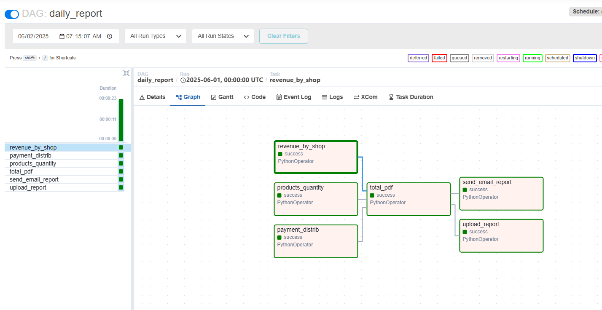
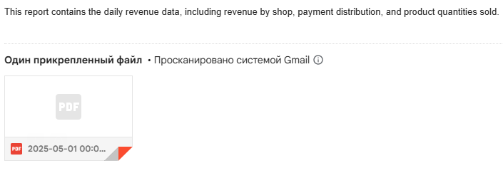
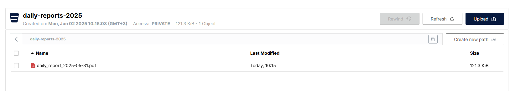
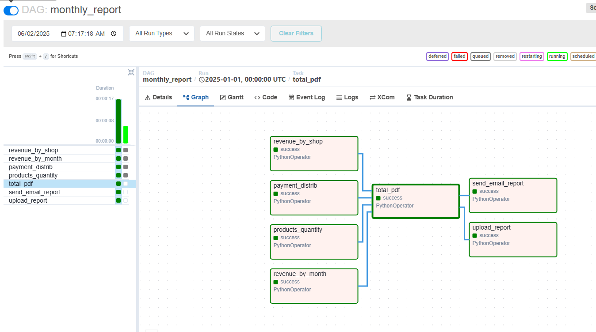
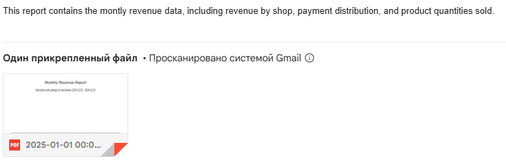
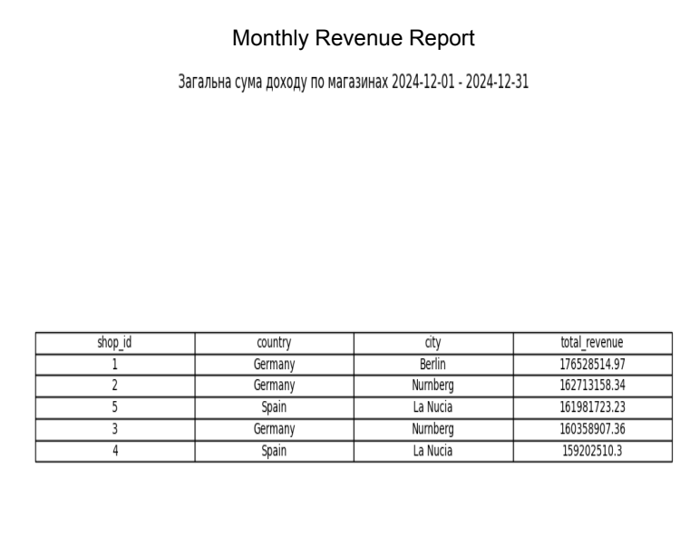
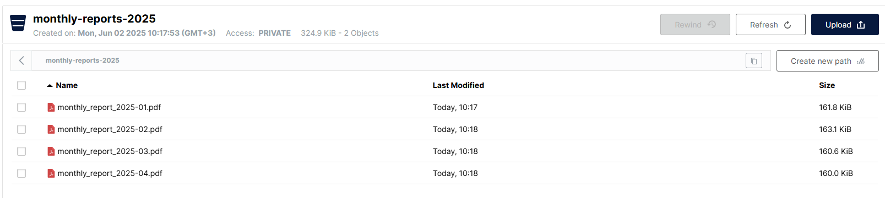
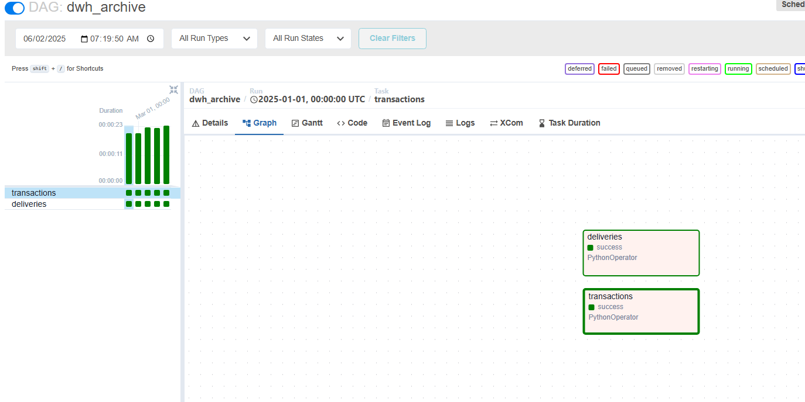
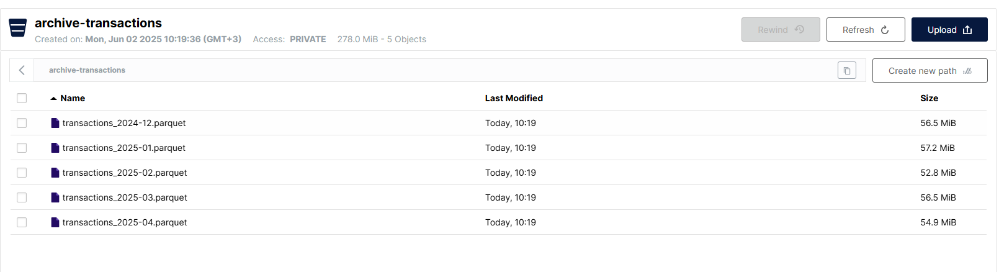

<!-- omit in toc -->
## Languages
[](https://www.python.org/)
[](https://en.wikipedia.org/wiki/SQL)

<!-- omit in toc -->
## Frameworks
[](https://airflow.apache.org/)
[](https://pandas.pydata.org/)
[](https://github.com/ClickHouse/clickhouse-connect)
[](https://min.io/)
[](https://matplotlib.org/)
[](https://seaborn.pydata.org/)

<!-- omit in toc -->
## Services
[](https://clickhouse.com/)

<!-- omit in toc -->
## Table of Contents
- [Introduction](#introduction)
- [Project workflow](#project-workflow)
- [Docker Containers](#docker-containers)
- [Auto-analytic DAGs](#auto-analytic-dags)
  - [Daily DAG](#daily-dag)
  - [Monthly DAG](#monthly-dag)
  - [ClickHouse Archive DAG](#clickhouse-archive-dag)
- [Getting Started](#getting-started)
- [Next Section of the Project](#next-section-of-the-project)

## Introduction
🟢 **This is part 6 of 7 Docker sections in the 🔴 [Supermarket Simulation Project](https://github.com/SerhiiDolhopolov/rossmann_services).**

🔵 [**<- Previous part with API.**](https://github.com/SerhiiDolhopolov/rossmann_api)

## Project workflow
This section contains Airflow DAGs with auto-reports sent to email and archiving ClickHouse data to S3 to reduce the load on the DWH and lower data storage costs.

## Docker Containers
**This Docker section includes:**
  - **Airflow**
    - 🌐 Web interface: 
      - [localhost:1600](http://localhost:1600)
    - Login:
      - [airflow](airflow)
    - Password:
      - [airflow](airflow)
  
## Auto-analytic DAGs
The auto-analytic DAGs have a modular structure with a DAG template. It's easy to add a new diagram to a DAG.

### Daily DAG
The daily DAG has 3 parallel operators for creating diagrams, then an operator for creating a PDF with these diagrams, and then sends the PDF to email and S3.





### Monthly DAG
The monthly DAG has 4 parallel operators for creating diagrams, then an operator for creating a PDF with these diagrams, and then sends the PDF to email and S3. Each monthly diagram aggregation is saved in S3 to use for longer analytics because ClickHouse has a TTL of 4 months.






### ClickHouse Archive DAG
Each month, ClickHouse transactions are archived in S3 because S3 storage is several times cheaper. For archiving, the .parquet file format is used. This format has a high level of compression, columnar data storage, and both ClickHouse and Spark work well with it. The disadvantage is that people can't read the file directly.




## Getting Started
**To start:**
1. Complete all steps in the [main part](https://github.com/SerhiiDolhopolov/rossmann_services).
2. Run the services:
```bash
docker compose up --build
```

## Next Section of the Project

[Rossmann Spark](https://github.com/SerhiiDolhopolov/rossmann_spark)
